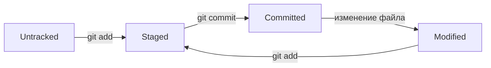

# Шпаргалка по Git для начинающих специалистов

Шпаргалка с основными командами и советами по Git.

---

## Настройка Git

Для начала работы в консоли Git нужно настроить имя и email:

```bash
git config --global user.name "Имя"         # Имя пользователя
git config --global user.email "email"      # Email
git config --list                            # Проверка настроек
```

---

## Работа с репозиторием

* `git init` — создать новый репозиторий
* Создать удалённый репозиторий на GitHub: [https://github.com/](https://github.com/)
* Сгенерировать SSH-ключ для защиты репозитория:

```bash
ssh-keygen -t ed25519 -C "ваш_email@пример.com"
```

* Связать локальный и удалённый репозиторий:

```bash
git remote add origin git@github.com:ВАШ_АККАУНТ/first-project.git
```

---

## Работа с файлами и рабочей директорией

**Команды оболочки (не Git)**:

```bash
pwd                         # Текущая директория
cd <путь>                   # Перейти в другую директорию
ls                          # Содержимое директории
touch <file>                # Создать файл
mkdir <folder>              # Создать папку
cp <file> <destination>     # Копировать файл
mv <file> <destination>     # Переместить файл или папку
cat <file>                  # Просмотр содержимого файла
```

**Команды Git для файлов:**

```bash
git add <file>              # Добавить файл
git add .                   # Добавить все изменения
git rm <file>               # Удалить файл из репозитория
git rm -r <folder>          # Рекурсивно удалить папку с содержимым
```

---

## Основные команды Git

```bash
git status                  # Проверить состояние репозитория
git commit -m "Сообщение"   # Зафиксировать изменения
git log                     # Просмотр истории коммитов
git log --oneline           # Список коммитов (хэши + сообщения )
```

---

## Работа с хэшами и HEAD

* Каждый коммит в Git имеет **уникальный хэш** (SHA-1).
* Хэш можно использовать для обращения к конкретному коммиту:

```bash
git checkout <hash>         # Перейти к состоянию определённого коммита
```

* `HEAD` — это ссылка на текущий коммит (обычно последний в ветке).
* Можно перемещать `HEAD` для навигации по истории:

```bash
git checkout HEAD~1         # Перейти на один коммит назад
```

---

## Статусы файлов в Git

* **untracked** — файл не отслеживается Git
* **staged** — файл добавлен в индекс (`git add`)
* **modified** — файл изменён, но не добавлен в индекс
* **committed** — изменения зафиксированы в истории репозитория  

 Жизненный цикл файла в Git:



---

## Работа с удалённым репозиторием

```bash
git push      # Отправить изменения на сервер
```

---

## Полезные советы для новичков

* Делайте маленькие и понятные коммиты 
* Проверяйте `git status` перед коммитом 
* Используйте комментарии к коммитам, чтобы было понятно, что изменилось
* Регулярно синхронизируйте репозиторий с удалённым сервером 
* Работайте с ветками для новых функций или исправлений 

